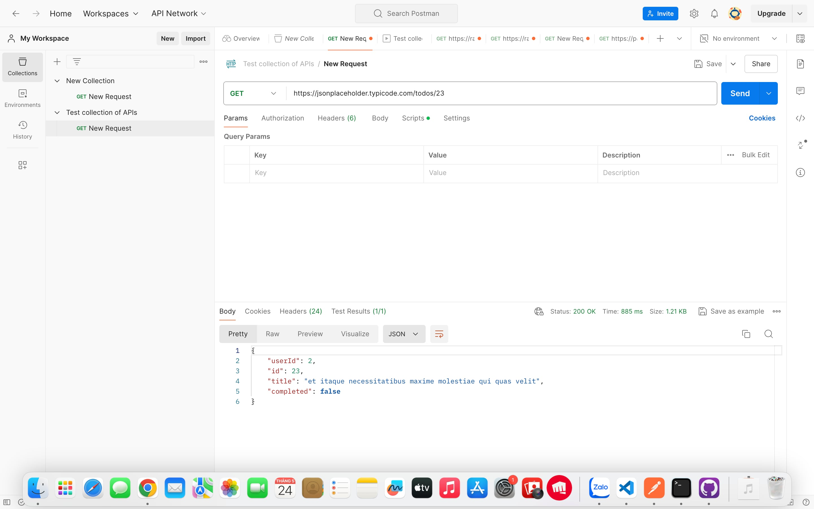
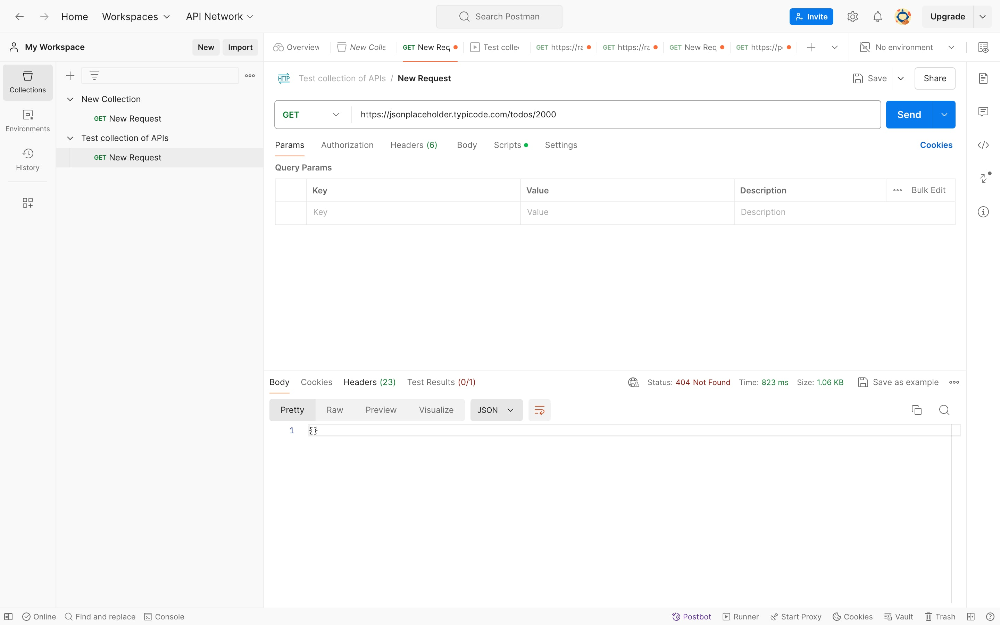
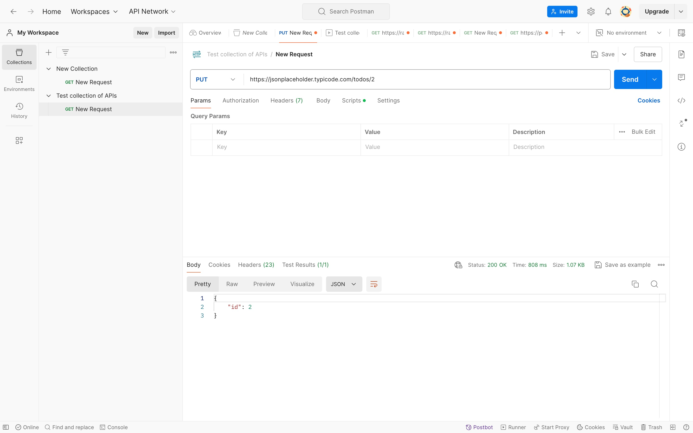

# Postman-collection-API

Tên Dự Án: Test Collection of APIs

Ngày Kiểm Thử: 28/05/2024

Người Kiểm Thử: Nguyễn Minh Phương

## Giới thiệu về Postman
**Postman là gì?**
- Postman là một công cụ mạnh mẽ và phổ biến dành cho việc phát triển, kiểm thử, và quản lý các API. Với Postman, người dùng có thể gửi các yêu cầu HTTP, xem và kiểm tra các phản hồi, tự động hóa các kịch bản kiểm thử và hợp tác trong phát triển API.
- Kiểm tra API: https://openweathermap.org/api

**Các tính năng chính của Postman**
- Gửi yêu cầu HTTP: Hỗ trợ đầy đủ các loại yêu cầu HTTP như GET, POST, PUT, DELETE, PATCH, OPTIONS.
- Quản lý yêu cầu và bộ sưu tập: Người dùng có thể tạo và quản lý các yêu cầu, tổ chức chúng thành các bộ sưu tập để dễ dàng kiểm thử.
- Biến và môi trường: Hỗ trợ biến số và môi trường để tái sử dụng các yêu cầu với dữ liệu động.
- Kiểm thử tự động: Hỗ trợ viết các kịch bản kiểm thử bằng JavaScript để tự động hóa quá trình kiểm thử.
- Chia sẻ và hợp tác: Hỗ trợ chia sẻ các bộ sưu tập và tài liệu API với nhóm phát triển.
- Tích hợp và mở rộng: Tích hợp với nhiều công cụ CI/CD và mở rộng tính năng thông qua các plugin.

## API Được Chọn

- https://jsonplaceholder.typicode.com/todos một danh sách các công việc với thông tin đầy đủ.

## API Endpoints

1. Kiểm Thử 1: Lấy thông tin của một công việc cụ thể

   - **URL**: `https://jsonplaceholder.typicode.com/todos/23`
   - **Method**: GET
   - **Expected Response Code**: 200 OK
   - 

2. Kiểm Thử 2: Kiểm tra xử lý lỗi khi truy cập không hợp lệ

   - **URL**: `https://jsonplaceholder.typicode.com/todos/2000`
   - **Method**: GET
   - **Expected Response Code**: 404 Not Found
   - 

3. Kiểm Thử 3: Sửa đổi một công việc

   - **URL**: `https://jsonplaceholder.typicode.com/todos/2`
   - **Method**: PUT
   - **Expected Response Code**: 200 OK
   - 

4. Kiểm Thử 4: Tạo mới một công việc

   - **URL**: `https://jsonplaceholder.typicode.com/todos`
   - **Method**: POST
   - **Expected Response Code**: 201 Created
   - 

## Báo Cáo Kiểm Thử Chi Tiết

1. Mục Tiêu Kiểm Thử:
   - Kiểm thử các chức năng cơ bản của API quản lý người dùng bao gồm tạo mới người dùng, xem danh sách người dùng, cập nhật thông tin người dùng và xóa người dùng.
   - Đảm bảo rằng các phương thức GET, POST, PUT và DELETE hoạt động chính xác và trả về kết quả mong đợi.
2. Phạm Vi Kiểm Thử:
   - Kiểm thử tất cả các endpoint của API:
     - GET /users
     - POST /users
     - PUT /users/{id}
     - DELETE /users/{id}
3. Kết Quả Kiểm Thử:
   - GET /users:
     - Kết quả: Thành công
     - Mô tả: API trả về danh sách các người dùng như mong đợi.
   - POST /users:
     - Kết quả: Thành công
     - Mô tả: API tạo mới người dùng và trả về thông tin của người dùng mới.
   - PUT /users/{id}:
     - Kết quả: Thành công
     - Mô tả: API cập nhật thông tin của người dùng có ID tương ứng.
   - DELETE /users/{id}:
     - Kết quả: Thành công
     - Mô tả: API xóa người dùng có ID tương ứng.
4. Khuyến Nghị:
   - Kiểm thử bổ sung: Tiếp tục kiểm thử để đảm bảo tính toàn vẹn và độ tin cậy của API trong các điều kiện và tình huống khác nhau, bao gồm kiểm thử với dữ liệu đầu vào không hợp lệ.
   - Tài liệu API chi tiết: Bổ sung tài liệu API với các ví dụ và hướng dẫn cụ thể cho các khách hàng và nhà phát triển sử dụng API.
   - Xác thực và phân quyền: Đảm bảo rằng API đã triển khai các cơ chế xác thực và phân quyền mạnh mẽ để bảo vệ dữ liệu người dùng.
   - Giảm thiểu lỗi: Kiểm tra các điều kiện biên và xử lý lỗi để giảm thiểu lỗi và cải thiện trải nghiệm người dùng cuối.
